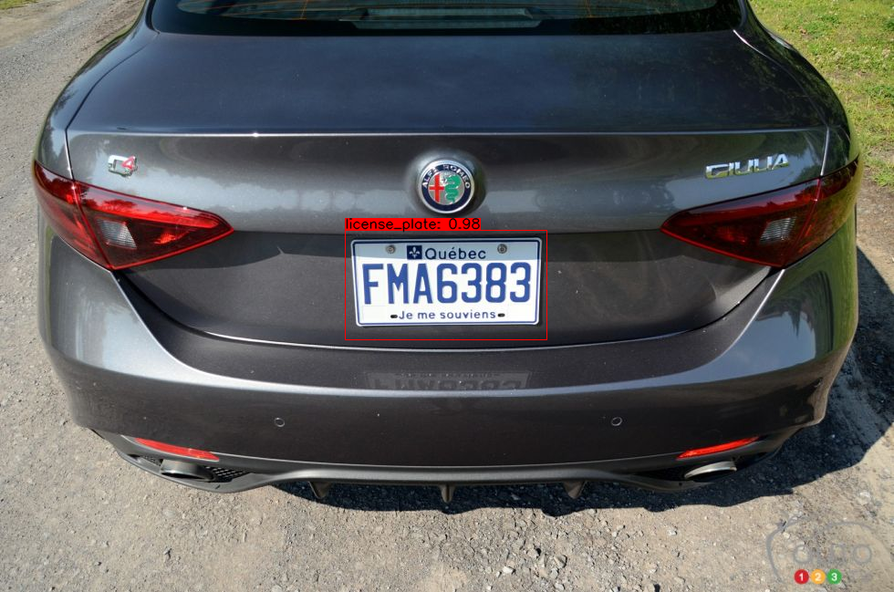
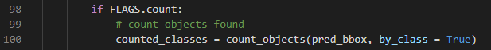
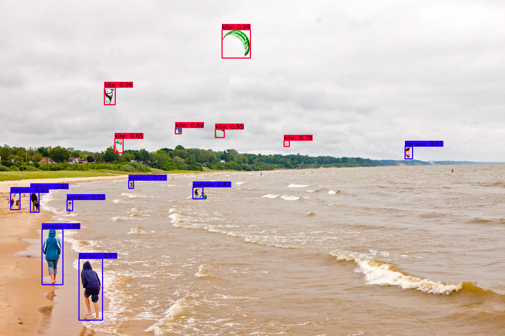

# License Plate Detection using yoloV4
## Getting Started
### Conda (Recommended)

```bash
# Tensorflow CPU
conda env create -f conda-cpu.yml
conda activate yolov4-cpu

# Tensorflow GPU
conda env create -f conda-gpu.yml
conda activate yolov4-gpu
```

### Pip
```bash
# TensorFlow CPU
pip install -r requirements.txt

# TensorFlow GPU
pip install -r requirements-gpu.txt
```

### Nvidia Driver (For GPU, if you are not using Conda Environment and haven't set up CUDA yet)
Make sure to use CUDA Toolkit version 10.1 as it is the proper version for the TensorFlow version used in this repository.
https://developer.nvidia.com/cuda-10.1-download-archive-update2

## Using Custom Trained YOLOv4 Weights
USE MY LICENSE PLATE TRAINED CUSTOM WEIGHTS: https://drive.google.com/file/d/1ivdpD0vDOiZHi3oot02-v59eqICnI8pZ/view?usp=sharing

Copy and paste your custom .weights file into the 'data' folder and copy and paste your custom .names into the 'data/classes/' folder.

## License Plate YOLOv4 Using TensorFlow
The following commands will allow you to run your license plate yolov4 model. (video and webcam commands work as well)
```
# License plate yolov4
python save_model.py --weights ./data/license_plate.weights --output ./checkpoints/license_plate-416 --input_size 416 --model yolov4 

# Run license plate yolov4 tensorflow model
python detect.py --weights ./checkpoints/license_plate-416 --size 416 --model yolov4 --images ./data/images/car.jpg
```

#### license plate YOLOv4 Model Example (see video link above to train this model)
<p align="center"></p>

## License Plate Functions and Flags
Here is how to use all the currently supported license plate functions and flags that I have created.

<a name="counting"/>

### Counting Objects (total objects or per class)
I have created a license plate function within the file [core/functions.py] that can be used to count and keep track of the number of objects detected at a given moment within each image or video. It can be used to count total objects found or can count number of objects detected per class.

#### Count Total Objects
To count total objects all that is needed is to add the license plate flag "--count" to your [detect.py] or detect_video.py command.
```
# Run yolov4 model while counting total objects detected
python detect.py --weights ./checkpoints/yolov4-416 --size 416 --model yolov4 --images ./data/images/dog.jpg --count
```
Running the above command will count the total number of objects detected and output it to your command prompt or shell as well as on the saved detection as so:
<p align="center"></p>

#### Count Objects Per Class
To count the number of objects for each individual class of your object detector you need to add the license plate flag "--count" as well as change one line in the detect.py or detect_video.py script. By default the count_objects function has a parameter called <strong>by_class</strong> that is set to False. If you change this parameter to <strong>True</strong> it will count per class instead.

To count per class make detect.py or detect_video.py look like this:
<p align="center"></p>

Then run the same command as above:
```
# Run yolov4 model while counting objects per class
python detect.py --weights ./checkpoints/yolov4-416 --size 416 --model yolov4 --images ./data/images/dog.jpg --count
```
Running the above command will count the number of objects detected per class and output it to your command prompt or shell as well as on the saved detection as so:
<p align="center"></p>

<strong>Note:</strong> You can add the --count flag to detect_video.py commands as well!

<a name="info"/>

### Print Detailed Info About Each Detection (class, confidence, bounding box coordinates)
I have created a license plate flag called <strong>INFO</strong> that can be added to any detect.py or detect_video.py commands in order to print detailed information about each detection made by the object detector. To print the detailed information to your command prompt just add the flag `--info` to any of your commands. The information on each detection includes the class, confidence in the detection and the bounding box coordinates of the detection in xmin, ymin, xmax, ymax format.

If you want to edit what information gets printed you can edit the <strong>draw_bbox</strong> function found within the [core/utils.py] file. The line that prints the information looks as follows:
<p align="center"></p>

Example of info flag added to command:
```
python detect.py --weights ./checkpoints/yolov4-416 --size 416 --model yolov4 --images ./data/images/dog.jpg --info
```
Resulting output within your shell or terminal:
<p align="center"></p>

<strong>Note:</strong> You can add the --info flag to detect_video.py commands as well!

<a name="crop"/>

### Crop Detections and Save Them as New Images
I have created a license plate function within the file [core/functions.py] that can be applied to any detect.py or detect_video.py commands in order to crop the YOLOv4 detections and save them each as their own new image. To crop detections all you need to do is add the `--crop` flag to any command. The resulting cropped images will be saved within the <strong>detections/crop/</strong> folder.
  
 Example of crop flag added to command:
```
python detect.py --weights ./checkpoints/yolov4-416 --size 416 --model yolov4 --images ./data/images/dog.jpg --crop

python detect_video.py --weights ./checkpoints/yolov4-416 --size 416 --model yolov4 --video ./data/video/counting_cars.mp4 --output ./detections/recognition.avi --count
```
 Here is an example of one of the resulting cropped detections from the above command.
 <p align="center"></p>
 
<a name="license"/>

## License Plate Recognition Using Tesseract OCR
I have created a license plate function to feed Tesseract OCR the bounding box regions of license plates found by my license plate YOLOv4 model in order to read and extract the license plate numbers. Thorough preprocessing is done on the license plate in order to correctly extract the license plate number from the image. The function that is in charge of doing the preprocessing and text extraction is called <strong>recognize_plate</strong> and can be found in the file [core/utils.py].

<strong>Disclaimer: In order to run tesseract OCR you must first download the binary files and set them up on your local machine. Please do so before proceeding or commands will not run as expected!</strong>

Official Tesseract OCR Github Repo: [tesseract-ocr/tessdoc](https://github.com/tesseract-ocr/tessdoc)

Great Article for How To Install Tesseract on Mac or Linux Machines: [PyImageSearch Article](https://www.pyimagesearch.com/2017/07/03/installing-tesseract-for-ocr/)

For Windows I recommend: [Windows Install](https://github.com/UB-Mannheim/tesseract/wiki)

Once you have Tesseract properly installed you can move onwards. If you don't have a trained YOLOv4 model to detect license plates feel free to use one that I have trained. It is not perfect but it works well. [Download license plate detector model and learn how to save and run it with TensorFlow here](#license plate)

### Running License Plate Recognition on Images (video example below)
The license plate recognition works wonders on images. All you need to do is add the `--plate` flag on top of the command to run the license plate YOLOv4 model.

Try it out on this image in the repository!
```
# Run License Plate Recognition
python detect.py --weights ./checkpoints/license_plate-416 --size 416 --model yolov4 --images ./data/images/car2.jpg --plate
```
### Running License Plate Recognition on Video
Running the license plate recognition straight on video at the same time that YOLOv4 object detections causes a few issues. Tesseract OCR is fairly expensive in terms of time complexity and slows down the processing of the video to a snail's pace. It can still be accomplished by adding the `--plate` command line flag to any detect_video.py commands.

However, I believe the best route to go is to run video detections without the plate flag and instead run them with `--crop` flag which crops the objects found on screen and saves them as new images. [See how it works here](#crop) Once the video is done processing at a higher FPS all the license plate images will be cropped and saved within [detections/crop] folder. I have added an easy script within the repository called [license_plate_recognizer.py] that you can run in order to recognize license plates. Plus this allows you to easily license plateize the script to further enhance any recognitions. I will be working on linking this functionality automatically in future commits to the repository.

Running License Plate Recognition with detect_video.py is done with the following command.
```
python detect_video.py --weights ./checkpoints/license_plate-416 --size 416 --model yolov4 --video ./data/video/license_plate.mp4 --output ./detections/recognition.avi --plate

python detect_video.py --weights ./checkpoints/license_plate-416 --size 416 --model yolov4 --video ./data/video/counting_cars.mp4 --output ./detections/recognition.avi --count
```

The recommended route I think is more efficient is using this command. license plateize the rate at which detections are cropped within the code itself.
```
python detect_video.py --weights ./checkpoints/license_plate-416 --size 416 --model yolov4 --video ./data/video/license_plate.mp4 --output ./detections/recognition.avi --crop
```

Now play around with [license_plate_recognizer.py] and have some fun!

<a name="ocr"/>

## Running Tesseract OCR on any Detections
I have also implemented a generic use of Tesseract OCR with YOLOv4. By enabling the flag `--ocr` with any detect.py image command you can search detections for text and extract what is found. Generic preprocessing is applied on the subimage that makes up the inside of the detection bounding box. However, so many lighting or color issues require advanced preprocessing so this function is by no means perfect. You will also need to install tesseract on your local machine prior to running this flag (see links and suggestions in above section)

Example command (note this image doesn't have text so will not output anything, just meant to show how command is structured):
```
python detect.py --weights ./checkpoints/yolov4-416 --size 416 --model yolov4 --images ./data/images/dog.jpg --ocr
```

## YOLOv4 Using TensorFlow Lite (.tflite model)
Can also implement YOLOv4 using TensorFlow Lite. TensorFlow Lite is a much smaller model and perfect for mobile or edge devices (raspberry pi, etc).
```bash
# Save tf model for tflite converting
python save_model.py --weights ./data/yolov4.weights --output ./checkpoints/yolov4-416 --input_size 416 --model yolov4 --framework tflite

# yolov4
python convert_tflite.py --weights ./checkpoints/yolov4-416 --output ./checkpoints/yolov4-416.tflite

# yolov4 quantize float16
python convert_tflite.py --weights ./checkpoints/yolov4-416 --output ./checkpoints/yolov4-416-fp16.tflite --quantize_mode float16

# yolov4 quantize int8
python convert_tflite.py --weights ./checkpoints/yolov4-416 --output ./checkpoints/yolov4-416-int8.tflite --quantize_mode int8 --dataset ./coco_dataset/coco/val207.txt

# Run tflite model
python detect.py --weights ./checkpoints/yolov4-416.tflite --size 416 --model yolov4 --images ./data/images/kite.jpg --framework tflite
```
### Result Image (TensorFlow Lite)
You can find the outputted image(s) showing the detections saved within the 'detections' folder.
#### TensorFlow Lite int8 Example
<p align="center"></p>

Yolov4 and Yolov4-tiny int8 quantization have some issues. I will try to fix that. You can try Yolov3 and Yolov3-tiny int8 quantization 

## YOLOv4 Using TensorRT
Can also implement YOLOv4 using TensorFlow's TensorRT. TensorRT is a high-performance inference optimizer and runtime that can be used to perform inference in lower precision (FP16 and INT8) on GPUs. TensorRT can allow up to 8x higher performance than regular TensorFlow.
```bash# yolov3
python save_model.py --weights ./data/yolov3.weights --output ./checkpoints/yolov3.tf --input_size 416 --model yolov3
python convert_trt.py --weights ./checkpoints/yolov3.tf --quantize_mode float16 --output ./checkpoints/yolov3-trt-fp16-416

# yolov3-tiny
python save_model.py --weights ./data/yolov3-tiny.weights --output ./checkpoints/yolov3-tiny.tf --input_size 416 --tiny
python convert_trt.py --weights ./checkpoints/yolov3-tiny.tf --quantize_mode float16 --output ./checkpoints/yolov3-tiny-trt-fp16-416

# yolov4
python save_model.py --weights ./data/yolov4.weights --output ./checkpoints/yolov4.tf --input_size 416 --model yolov4
python convert_trt.py --weights ./checkpoints/yolov4.tf --quantize_mode float16 --output ./checkpoints/yolov4-trt-fp16-416
python detect.py --weights ./checkpoints/yolov4-trt-fp16-416 --model yolov4 --images ./data/images/kite.jpg --framework trt
```

## Command Line Args Reference

```bash
save_model.py:
  --weights: path to weights file
    (default: './data/yolov4.weights')
  --output: path to output
    (default: './checkpoints/yolov4-416')
  --[no]tiny: yolov4 or yolov4-tiny
    (default: 'False')
  --input_size: define input size of export model
    (default: 416)
  --framework: what framework to use (tf, trt, tflite)
    (default: tf)
  --model: yolov3 or yolov4
    (default: yolov4)

detect.py:
  --images: path to input images as a string with images separated by ","
    (default: './data/images/kite.jpg')
  --output: path to output folder
    (default: './detections/')
  --[no]tiny: yolov4 or yolov4-tiny
    (default: 'False')
  --weights: path to weights file
    (default: './checkpoints/yolov4-416')
  --framework: what framework to use (tf, trt, tflite)
    (default: tf)
  --model: yolov3 or yolov4
    (default: yolov4)
  --size: resize images to
    (default: 416)
  --iou: iou threshold
    (default: 0.45)
  --score: confidence threshold
    (default: 0.25)
  --count: count objects within images
    (default: False)
  --dont_show: dont show image output
    (default: False)
  --info: print info on detections
    (default: False)
  --crop: crop detections and save as new images
    (default: False)
    
detect_video.py:
  --video: path to input video (use 0 for webcam)
    (default: './data/video/video.mp4')
  --output: path to output video (remember to set right codec for given format. e.g. XVID for .avi)
    (default: None)
  --output_format: codec used in VideoWriter when saving video to file
    (default: 'XVID')
  --[no]tiny: yolov4 or yolov4-tiny
    (default: 'false')
  --weights: path to weights file
    (default: './checkpoints/yolov4-416')
  --framework: what framework to use (tf, trt, tflite)
    (default: tf)
  --model: yolov3 or yolov4
    (default: yolov4)
  --size: resize images to
    (default: 416)
  --iou: iou threshold
    (default: 0.45)
  --score: confidence threshold
    (default: 0.25)
  --count: count objects within video
    (default: False)
  --dont_show: dont show video output
    (default: False)
  --info: print info on detections
    (default: False)
  --crop: crop detections and save as new images
    (default: False)
```
